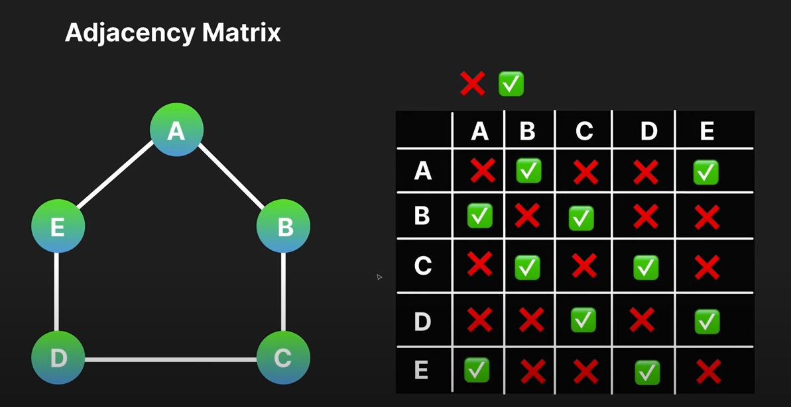
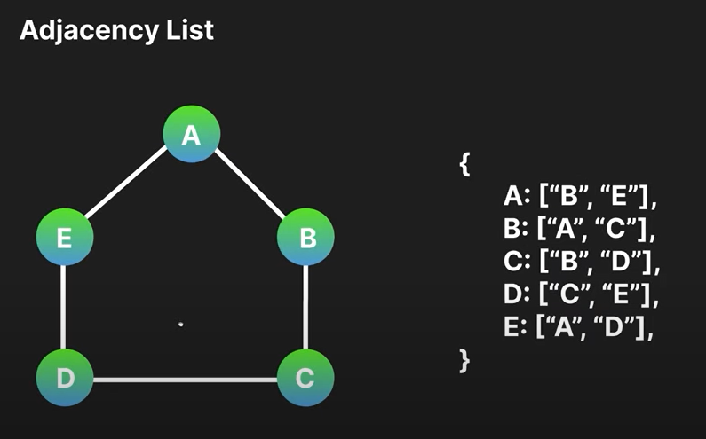

# Graph
```
A graph is a non-linear data structure that models relationships between objects. It consists of two main components Vertices (Nodes) & Edges.
```
1. <span style="color:gray; font-weight:bold">Vertices(Nodes):</span> 
These represents the individual entities within the graph.

2. <span style="color:gray; font-weight:bold">Edges:</span>
These connect vertices, signifying a relationship or connection between them.

## Adjacency matrix:


- <span style="color:gray; font-weight:bold">Adjacency Matrix:</span> The adjacency matrix is a square matrix used to represent a finite graph. Each element of the matrix indicates whether there is an edge between two vertices. In this image, the adjacency matrix visually represents the connections between vertices in a graph, where '1' | ✔ indicates the presence of an edge and '0' | ❌ indicates the absence of an edge.

## Adjacency list:


- <span style="color:gray; font-weight:bold;">Adjacency List:</span> An adjacency list is a collection of linked lists used to represent a graph. Each list describes the set of neighbors of a vertex in the graph. In this image, the adjacency list visually represents the connections between vertices in a graph. Each entry in the list corresponds to a vertex, and the elements in the list indicate the vertices that are directly connected to it. This format is efficient for graphs with a large number of vertices and fewer edges, as it only uses space proportional to the number of edges.