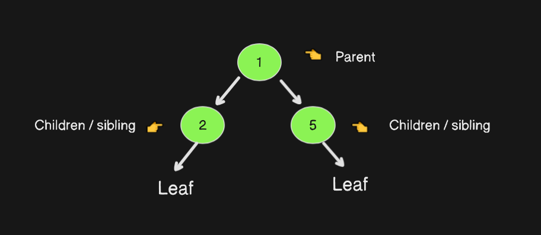

# Tree
## --> A DS tree is fundamental hierarchical data structure. It represents a collection of elements (data) called nodes, connected by edges (links) forming a tree-like structure. 

```
Decision Tree
```



