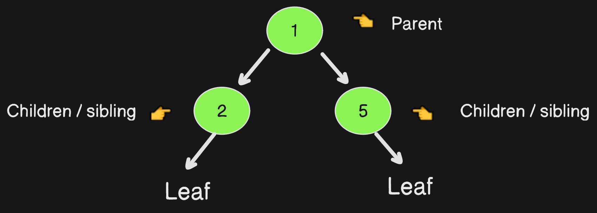
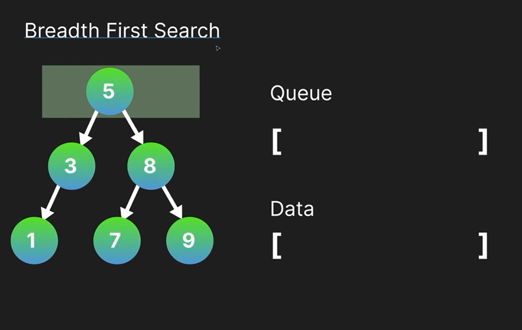

# Tree
## --> A DS tree is fundamental hierarchical data structure. It represents a collection of elements (data) called nodes, connected by edges (links) forming a tree-like structure. 

```
Decision Tree
```


## Full Tree:
```
Each node either has no children(leaf node) or exactly two children.
```
## Perfect Tree:
```
Full + Balance
Balance: All the leaf nodes are at the same depth (distance from root). This means the tree is completely filled with no gaps at any level.
```
## Complete Tree:
```
Almost Full levels: All levels excepts possibly the last one are completely filled with nodes.
Leaf leaning last level: The last level is filled with nodes from the left side as much as possible. There might be empty spaces on the right.
```
# BST (Binary Search Tree)
```
A BST is a special kind of binary tree used to organize data in a sorted way. It works like filing cabinet where you can efficiently search, add or remove items.
```
### Note:
- Go left if your value is smaller than the current branch.
- Go right if your value is bigger.

## Breadth First Search

